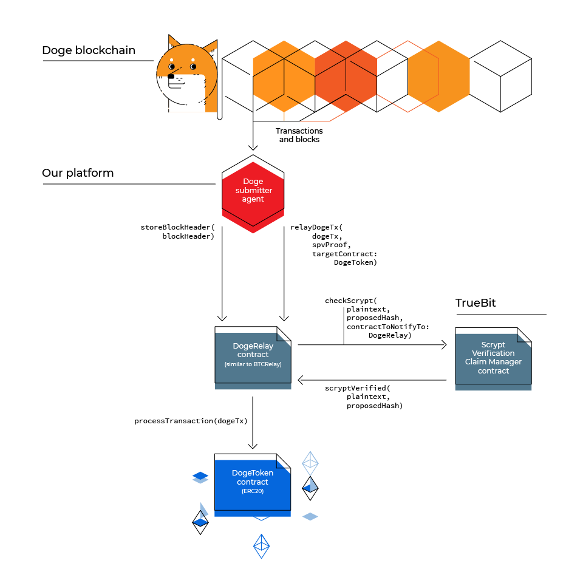

# DogeRelay

DogeRelay is a set of contracts that enable sending coins from the Dogecoin blockchain to ethereum blockchain.

Core components:
* [DogeRelay contract](contracts/DogeRelay.sol)
  * Keeps a copy of the Dogecoin blockchain (just the headers)
  * Informs [DogeToken contract](contracts/token/DogeToken.sol) when a Dogecoin transaction locked funds.
  * Inspired on [BtcRelay](https://github.com/ethereum/btcrelay).
* [DogeToken contract](contracts/token/DogeToken.sol)
  * An ERC20 contract where 1 token is worth 1 Dogecoin.
  * Tokens are minted when coins are locked on the Dogecoin blockchain.

Related projects:

* [Scrypt hash verification](https://github.com/TrueBitFoundation/scrypt-interactive): Interactive (i.e. challenge/response) validation of Scrypt hashes.
* DogeSubmitter agent: Monitors the dogecoin blockchain and sends relevant blocks and txs to DogeRelay contract.


## Design




## Incentives

Some operations require gas to be spent. Here are the incentives for doing that.

* Sending dogecoin blocks to DogeRelay: Block relayers will get a fee when the block they sent is used to relay a tx.
* Sending dogecoin txs to DogeRelay: Each user will send their own dogecoin lock tx to get dogetokens.
* Scrypt hash challengers: If they find an invalid hash, they will get some eth after the challenge/response game finishes.


## Notes

* DogeRelay uses a checkpoint instead of starting from dogecoin blockchain genesis.
* Dogecoin lock txs don't have to specify a destination eth address. Dogetokens will be assigned to the address controlled by the private key that signed the dogecoin lock tx.

## Workflow
* New Dogecoin block
  * There is a new block on the doge blockchain.
  * DogeSubmitter agent finds out the new block and sends the block header and its scrypt hash to DogeRelay contract.
  * DogeRelay sends the block header and its scrypt hash to Scrypt [Claim Manager contract](https://github.com/TrueBitFoundation/scrypt-interactive/blob/master/contracts/claimManager.sol).
  * There is a contest period for challengers…
  * If no challenge to the scrypt hash was done (or if challenge failed) Claim Manager contract notifies DogeRelay the hash is ok.
  * DogeRelay checks everything is ok with the block (PoW, the block connects to the blockchain, etc) and adds it to its doge blockchain.

* Sending dogecoins to ethereum
  * A user opens her Dogecoin-qt and sends a doge tx with N dogecoins to the “lock” doge address.
  * The doge tx is included in a doge block and 100 doge blocks are mined on top of it.
  * DogeSubmitter Agent notices a doge “lock” tx that has 100 confirmations.
  * DogeSubmitter Agent sends an eth tx to DogeRelay containing the doge “lock” tx with a partial merkle tree showing it was included in a doge block.
  * DogeRelay checks the SPV proof (valid doge tx, tx included in the partial merkle tree, partial merkle tree root included in a block, the tx has at least 100 confirmations).
  * DogeRelay relays the doge tx to DogeToken contract.
  * DogeToken checks the doge tx sends funds to the “lock” doge address.
  * DogeToken mints N tokens and assigns them to the doge tx sender (sender eth account address controlled by the same private key that signed the doge tx).


## Running the Tests

* Install prerequisites
  * [nodejs](https://nodejs.org) v9.2.0 or above.
  * [truffle](http://truffleframework.com/) v4.0.1 or above.
  * [ganache-cli](https://github.com/trufflesuite/ganache-cli) v6.0.3 or above.
  * Make truffle use solidity compiler v0.4.19 or above.
    * Open a terminal and go to the truffle folder
      * e.g. If you are on a mac, using nvm and node 9.2.0 `cd ~/.nvm/versions/node/v9.2.0/lib/node_modules/truffle/`
    * Edit package.json and update solc dependency version
      ```
        "dependencies": {
          ...
          "solc": "^0.4.19"
          ...
        }
      ```
    * Run `npm install` on the truffle folder
* Clone this repo.
* Install npm dependencies.
  * cd to the directory where the repo is cloned.
  ```
    npm install
  ```
* Run tests:
  ```
    # first start ganache-cli
    ganache-cli --gasLimit 4000000000000

    # run tests
    truffle test
  ```

## Deployment

To deploy the contracts

### Requirements

* A ropsten client running with rpc enabled

### Preparation

* Copy `local_config.json.example` to `local_config.json`
* Replace _seed_ and _address_ fields in the configuration
* Verify _rpcpath_ in `config.js` points to a ropsten RPC client

### Deployment

* Run `truffle migrate --network ropsten`

**Note**: Do not commit `local_config.json` file!

## Team

* [Ismael Bejarano](https://github.com/ismaelbej)
* [Catalina Juarros](https://github.com/cat-j)
* [Pablo Yabo](https://github.com/pipaman)
* [Oscar Guindzberg](https://github.com/oscarguindzberg)

## License

Copyright (c) 2017 Coinfabrik and Oscar Guindzberg. You will need to get a written authorization from them to use this code.

## Doge-Eth bounty
This is our eth address: 0x1ed3e252dcb6d540947d2d63a911f56733d55681
